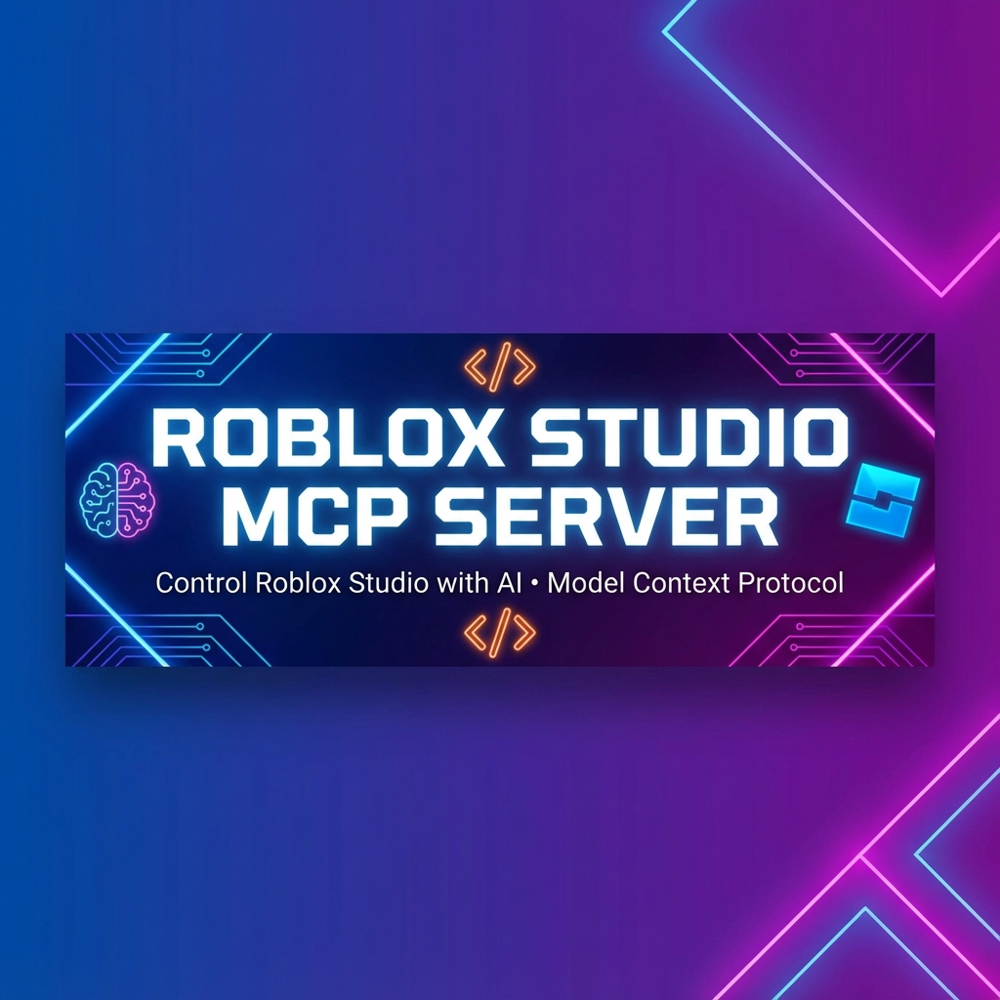

<div align="center">



# 🎮 Roblox Studio MCP Server

**Control Roblox Studio with AI • Model Context Protocol**

[](https://opensource.org/licenses/MIT)
[](https://www.rust-lang.org/)
[](https://www.roblox.com/)

**Empower LLMs to directly control your Roblox Studio session** - far beyond simple code generation.

[Features](#-key-features) • [Installation](#-installation) • [Usage](#-usage) • [Ideas 2025](./docs/development_ideas.md)

</div>

---

## 🚀 Key Features

### 📜 Scripting & Coding (NEW)
- **`create_script(name, parent, type, source)`**: Create Scripts, LocalScripts, or ModuleScripts instantly.
- **`read_script(path)`**: Read the source code of any script.
- **`update_script(path, source)`**: Modify script logic on the fly.
- **`run_command(command)`**: Execute arbitrary Luau snippets immediately.

### 🧠 Smart System Installer
- **`install_system(system_name="Quest System")`**: The "Magic Button"
  - Automatically searches, downloads, inserts, and unpacks complex systems.

### 🔍 Advanced Web Research (Tavily AI)
- **`search_web_scripts`**: Deep-dive analysis to find complex solutions and latest tutorials using Tavily AI.

### 📦 Marketplace & Asset Management
- **`search_creator_store`**: Search the Roblox Creator Store/Toolbox (Models, Audio, Plugins, etc.).
- **`download_asset`**: Download raw asset files to your computer.

### 🛠️ Studio Control
- **`get_file_tree`** / **`get_project_structure`**: Explore game hierarchy.
- **`set_property`** / **`get_instance_properties`**: Manipulate object properties.
- **`smart_unpack`**: Automatically organize inserted models.

---

## 📥 Installation

### Option 1: Install from Release Binaries (Recommended)

1. **Prerequisites**: [Roblox Studio](https://create.roblox.com/docs/en-us/studio/setup), [Claude Desktop](https://claude.ai/download) or [Cursor](https://www.cursor.com/).
2. **Download**: Get the latest release from the [Releases](https://github.com/TheLorianOMG/Roblox-mcp/releases) page.
3. **Run**: Run the installer and restart your AI client.

### Option 2: Build from Source

```bash
git clone https://github.com/TheLorianOMG/Roblox-mcp.git
cd Roblox-mcp
cargo run
```

---

## 🎯 Usage Examples

**Generate a complex system:**
```
Create a ModuleScript named 'DataManager' in ServerScriptService that handles player data saving with ProfileService.
```

**Analyze and fix code:**
```
Read the script at game.ServerScriptService.GameLoop and fix the memory leak in the while loop.
```

**Research and implement:**
```
Research how to make a wall jumping mechanic and implement it in a LocalScript in StarterPlayerScripts.
```

---

## 📚 Documentation

For a full list of tools and detailed documentation, see the [docs](./docs) folder.

Check out **[Development Ideas 2025](./docs/development_ideas.md)** for inspiration!

---

## 📞 Contact

**TheLorianOMG** - [GitHub](https://github.com/TheLorianOMG)
